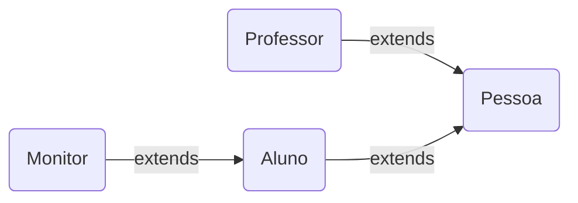

# POO - Classes Pessoa, Professor, Aluno e Monitor

Projeto acadêmico em **Java** da matéria de Programação Orientada a Objetos. Programa desenvolvido com o objetivo de aprender os conceitos de **POO** utilizando as classes Pessoa, Professor, Aluno e Monitor, criando atributos, métodos e construtores para cada classe. As classes Aluno e Professor herdam da classe Pessoa e a classe Monitor herda da classe Aluno.

